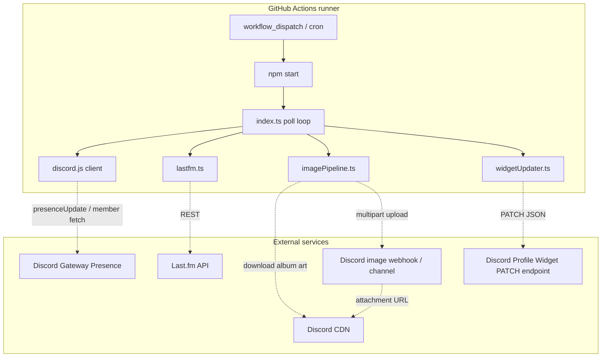

# 🎵 Discord Last.fm Profile Widget

> **Cloud-hosted Last.fm + Discord Spotify Presence → Discord Dynamic Profile Widget.**
> A single-user Discord bot that keeps your profile widget updated with live music, corrected album art, and rotating Last.fm stats — no VPS, no local PC, no frontend.

<p align="center">
  
  
  
  
</p>

```text
No VPS              No website frontend       No database
No local machine    GitHub Actions daemon     Discord profile widget only
```

---

## What this project does

This repo runs a long-lived GitHub Actions job that:

1. Logs in as your Discord bot.
2. Reads your live Spotify activity from Discord presence.
3. Uses Last.fm for music stats and optional now-playing fallback.
4. Corrects album art using a D.W.I.F-style image transform.
5. Uploads corrected album art to Discord CDN through a webhook or bot channel.
6. Builds one full Discord Dynamic Identity payload.
7. PATCHes your Discord profile widget.
8. Exits cleanly before GitHub's 6-hour limit and queues the next run.

It is designed for one Discord account and one Last.fm profile.

---

## Features

- 🎧 Live now-playing from Discord Spotify presence
- 📡 Last.fm-backed top artists, albums, tracks, scrobbles, and account stats
- 🖼 Corrected `album_art` image output for Discord's widget frame
- 🔁 Rotating 6-card stat pages
- ⚡ Payload de-duplication so identical updates are not PATCHed again
- 🤖 `/ping` and `/status` slash commands
- ☁️ GitHub Actions daemon hosting
- 🧯 Clean exit before GitHub Actions timeout

---

## Documentation

| Document | Purpose |
| --- | --- |
| [Setup](docs/SETUP.md) | Discord app, widget fields, Last.fm key, secrets |
| [Hosting](docs/HOSTING.md) | GitHub Actions daemon, runtime budget, local run |
| [Architecture](docs/ARCHITECTURE.md) | Module design, daemon lifecycle, Mermaid diagrams |
| [API flow](docs/API_FLOW.md) | External API calls, sequence diagrams, payload shape |
| [Image pipeline](docs/IMAGE_PIPELINE.md) | D.W.I.F-style album-art correction and Discord CDN upload |
| [Widget fields](docs/widget-setup.md) | Exact Discord widget editor field bindings |
| [Troubleshooting](docs/TROUBLESHOOTING.md) | Common failures and fixes |
| [Credits](docs/CREDITS.md) | References, inspirations, upstream projects |

---

## Quick start

### 1. Fork / clone

```bash
git clone https://github.com/MeYashverma/discord-stats.fm-widget.git
cd discord-stats.fm-widget
npm install
cp .env.example .env
```

### 2. Required values

| Variable / secret | Description |
| --- | --- |
| `DISCORD_APP_ID` | Discord Developer Portal → Application ID |
| `DISCORD_USER_ID` | Your Discord user ID |
| `DISCORD_BOT_TOKEN` | Bot token from Discord Developer Portal |
| `LASTFM_API_KEY` | Free API key from Last.fm |
| `LASTFM_USERNAME` | Your Last.fm username |
| `DISCORD_IMAGE_WEBHOOK_URL` | Recommended webhook used to upload corrected album art |

`DISCORD_TARGET_CHANNEL_ID` is also supported as a bot-upload fallback, but `DISCORD_IMAGE_WEBHOOK_URL` is preferred because it matches the Lyrically widget image-hosting approach.

### 3. Run locally

```bash
npm run build
npm start
```

### 4. Run in GitHub Actions

Add the same values as repository secrets, then open:

```text
Actions → Update Last.fm Discord Widget → Run workflow
```

The workflow runs for about 5h50m, exits cleanly, then self-dispatches another run. A 6-hour cron is kept as a safety net.

---

## High-level architecture



More detailed diagrams are in [docs/ARCHITECTURE.md](docs/ARCHITECTURE.md) and [docs/API_FLOW.md](docs/API_FLOW.md).

---

## Widget fields summary

Set the widget image field to **User Data** with this exact field name:

```text
album_art
```

The bot also sends `hero_image` for compatibility with older layouts.

Common text fields:

```text
title
artist
album
subtitle
hdr_artist_4w
hdr_album_4w
hdr_song_4w
hdr_artist_6m
hdr_album_6m
hdr_song_6m
top_artist_4w
top_album_4w
top_song_4w
top_artist_6m
top_album_6m
top_song_6m
stats_page
```

Full setup: [docs/widget-setup.md](docs/widget-setup.md).

---

## API sources

| API | Used for |
| --- | --- |
| Discord Gateway | Live Spotify presence for near-instant track changes |
| Last.fm API | Top artists/albums/tracks, scrobbles, profile age, recent track fallback |
| Discord webhook / channel messages | Hosting corrected album-art PNGs on Discord CDN |
| Discord Profile Widget endpoint | Updating Dynamic Identity widget fields |

---

## Credits

This project exists because of community research around Discord profile widgets and several related projects:

- [Discord-Lyrically-Widget](https://github.com/MeYashverma/Discord-Lyrically-Widget) — album-art widget fix, webhook hosting pattern, and GitHub Actions daemon hosting ideas.
- [Discord-LaunchPad-Widget](https://github.com/MeYashverma/Discord-LaunchPad-Widget) — architecture/documentation style and D.W.I.F image pipeline references.
- [discord-lastfm-widget](https://github.com/MeYashverma/discord-lastfm-widget) — Last.fm widget payload experiments.
- [discord-waifu-widget](https://github.com/MeYashverma/discord-waifu-widget) — Discord widget automation experiments.
- [Genshin-Stats](https://github.com/MeYashverma/Genshin-Stats) — public README/documentation style.
- [D.W.I.F](https://github.com/AjaxFNC-YT/D.W.I.F) by AjaxFNC-YT — Discord Widget Image Fixer algorithm inspiration.
- [Chloe Cinders — Discord widgets article](https://chloecinders.com/blog/discord-widgets) — Discord widget setup research.
- [aamiaa widget creation script](https://gist.github.com/aamiaa/7cdd590e3949cd654758bc90bcb4710b) — widget creation reference.
- [Last.fm API](https://www.last.fm/api), [Discord Developer Docs](https://discord.com/developers/docs), and [GitHub Actions Docs](https://docs.github.com/actions).

See [docs/CREDITS.md](docs/CREDITS.md) for details.

---

## License

MIT — see [LICENSE](LICENSE).
