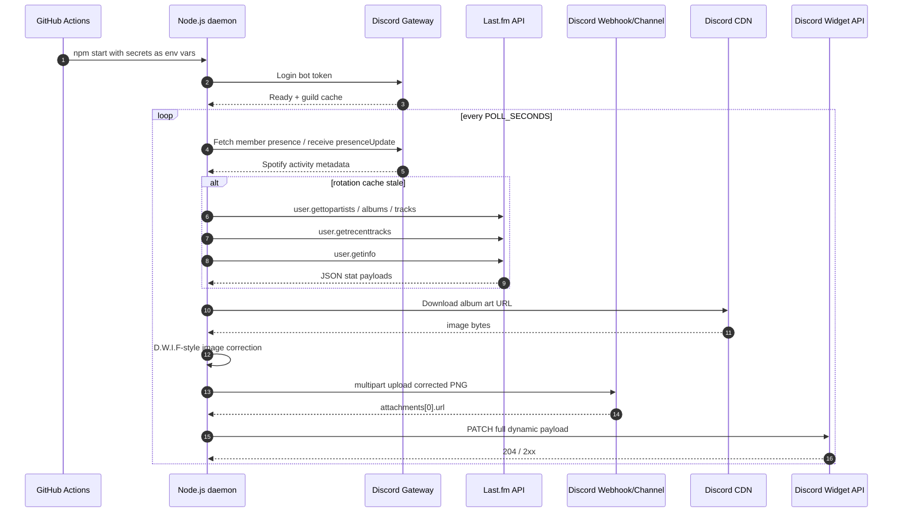

# API Flow

This document explains every external API this project talks to, when each request is made, and what data is used from each response.

---

## Services used

| Service | Protocol | Purpose |
| --- | --- | --- |
| Discord Gateway | WebSocket via `discord.js` | Read live Spotify presence |
| Last.fm API | HTTPS GET | Fetch top stats, recent tracks, user profile info |
| Discord webhook | HTTPS multipart POST | Upload corrected album-art PNGs to Discord CDN |
| Discord channel message API | HTTPS multipart POST | Alternative album-art upload path |
| Discord profile widget API | HTTPS PATCH | Update Dynamic Profile Widget fields |

---

## Complete request flow



---

## Discord Gateway flow

The bot uses these gateway intents:

```ts
GatewayIntentBits.Guilds
GatewayIntentBits.GuildPresences
GatewayIntentBits.GuildMembers
```

The bot must share at least one server with `DISCORD_USER_ID`. It reads your Spotify presence from a guild member presence.

Relevant fields from Discord activity:

| Discord activity field | Mapped field |
| --- | --- |
| `activity.details` | `title` |
| `activity.state` | `artist` |
| `activity.assets.largeText` | `album` |
| `activity.assets.largeImage` | album art URL / Spotify image ID |

Spotify presence is preferred because it gives near-instant start/stop/track-change events.

---

## Last.fm API flow

Base URL:

```text
https://ws.audioscrobbler.com/2.0/
```

Every request includes:

```text
api_key={LASTFM_API_KEY}
user={LASTFM_USERNAME}
format=json
```

### Endpoints

| Method | Used for |
| --- | --- |
| `user.getrecenttracks` | Recent track and optional now-playing fallback |
| `user.gettopartists` | Top artist cards and artist counts |
| `user.gettopalbums` | Top album cards and album counts |
| `user.gettoptracks` | Top track cards, track counts, scrobble-like totals |
| `user.getinfo` | Total playcount and account registration date |

### Period mapping

Last.fm does not have an exact `4 weeks` period. This project maps the widget's 4-week labels to Last.fm's closest built-in period:

| Widget label | Last.fm period |
| --- | --- |
| `4w` | `1month` |
| `6m` | `6month` |
| `Lifetime` | `overall` |

---

## Album-art upload flow

Preferred upload method:

```text
DISCORD_IMAGE_WEBHOOK_URL
```

Fallback upload method:

```text
DISCORD_TARGET_CHANNEL_ID + DISCORD_BOT_TOKEN
```

Webhook upload request:

```http
POST {DISCORD_IMAGE_WEBHOOK_URL}?wait=true
Content-Type: multipart/form-data

file = corrected PNG
```

Discord response shape:

```json
{
  "attachments": [
    {
      "url": "https://cdn.discordapp.com/attachments/.../lastfm-abc-dwif.png"
    }
  ]
}
```

That URL is then sent to the profile widget as the image field value.

---

## Discord Profile Widget PATCH

Endpoint:

```http
PATCH https://discord.com/api/v9/applications/{DISCORD_APP_ID}/users/{DISCORD_USER_ID}/identities/0/profile
Authorization: Bot {DISCORD_BOT_TOKEN}
Content-Type: application/json
User-Agent: DiscordBot (https://github.com/discord/discord-api-docs, 1.0.0)
```

The payload must include a root `username`. Without it, Discord can accept the request but the widget may continue showing fallback/editor values.

---

## Payload example

```json
{
  "username": "your-lastfm-username",
  "data": {
    "dynamic": [
      { "type": 1, "name": "title", "value": "Dior" },
      { "type": 1, "name": "artist", "value": "Shubh" },
      { "type": 1, "name": "album", "value": "Still Rollin" },
      { "type": 1, "name": "subtitle", "value": "Shubh • Still Rollin" },
      {
        "type": 3,
        "name": "album_art",
        "value": {
          "url": "https://cdn.discordapp.com/attachments/.../lastfm-abc-dwif.png"
        }
      },
      {
        "type": 3,
        "name": "hero_image",
        "value": {
          "url": "https://cdn.discordapp.com/attachments/.../lastfm-abc-dwif.png"
        }
      },
      { "type": 1, "name": "hdr_artist_4w", "value": "Top Artist(4w)" },
      { "type": 1, "name": "top_artist_4w", "value": "The Weeknd" },
      { "type": 1, "name": "stats_page", "value": "1/4 · Top Music" }
    ]
  }
}
```

---

## Error handling

| Failure | Behaviour |
| --- | --- |
| Discord presence unavailable | Try Last.fm now-playing fallback |
| Last.fm request fails | Keep previous rotation cache when possible |
| Image correction fails | Fall back to direct album-art URL |
| Webhook upload fails | Fall back to direct album-art URL |
| Discord PATCH returns 401/403 | Log auth/setup error; do not retry endlessly |
| Discord PATCH returns 429 | Honour retry headers and skip current update |
| Payload unchanged | Skip PATCH entirely |

---

## Rate-limit notes

- Last.fm calls are grouped and cached for `TOPS_POLL_SECONDS`.
- Discord widget PATCH happens only when the payload changes.
- Image correction/upload is cached in process memory per source art URL.
- GitHub Actions logs should show `Widget unchanged; skipping Discord PATCH` when no visible widget data changed.
