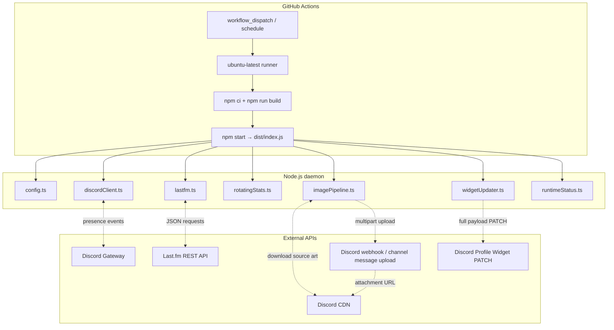
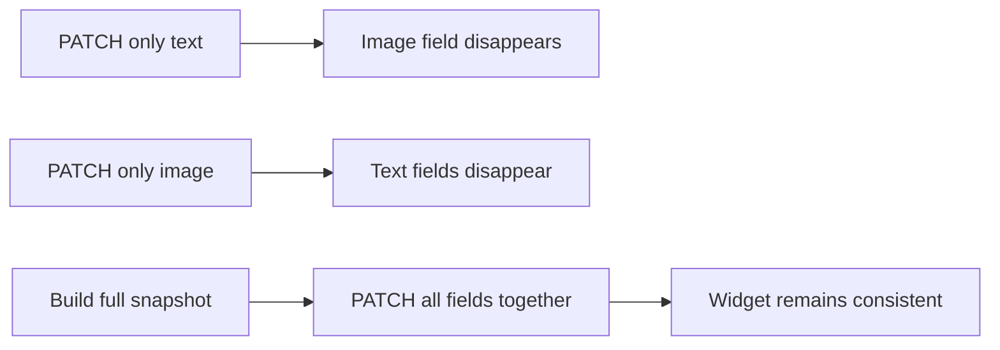
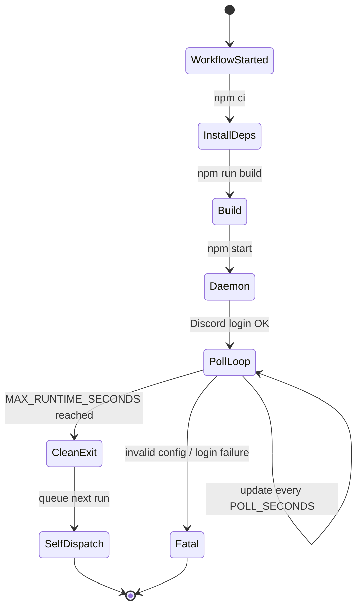
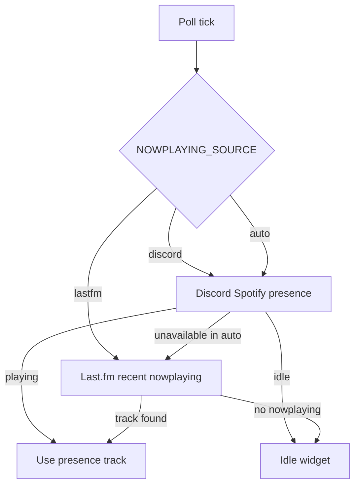
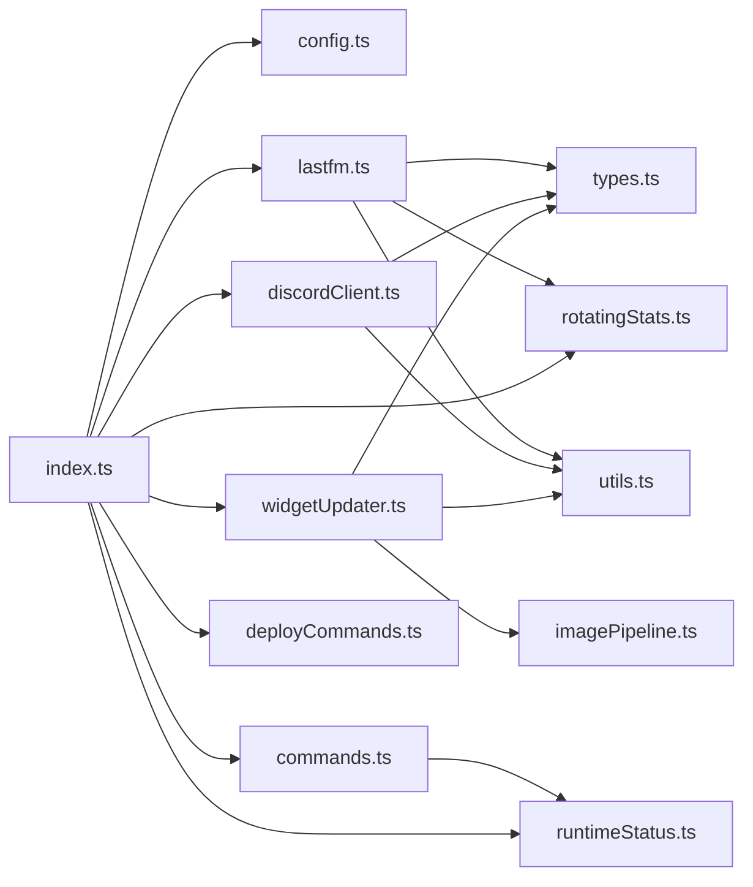

# Architecture

This document describes how the Vinyl.fm daemon is structured, how one update cycle works, and why the project is intentionally designed as a single long-lived process.

---

## Runtime overview



---

## Main design choices

### Single updater, full payload

Discord does **not** merge partial dynamic identity updates. Each PATCH replaces the dynamic data set. For that reason, this project always builds and sends one full payload containing text fields and image fields together.



### Long-lived Actions daemon

A scheduled workflow every minute is too slow for live now-playing and wastes startup time. Instead, the workflow starts a daemon that loops for about 5h50m, then exits before GitHub's 6-hour hard limit.



### Now-playing source modes

Vinyl.fm defaults to Last.fm now-playing to avoid requiring Discord presence setup. You can switch to Discord Spotify presence, or use auto mode.



---

## Module map



| File | Responsibility |
| --- | --- |
| `src/index.ts` | Main daemon, poll loop, page rotation, shutdown budget |
| `src/config.ts` | Environment parsing and validation with Zod |
| `src/discordClient.ts` | Discord login, gateway presence, Spotify activity parsing |
| `src/lastfm.ts` | Last.fm API client and Last.fm → rotation data mapping |
| `src/rotatingStats.ts` | 4 stat-page definitions and formatting helpers |
| `src/imagePipeline.ts` | Album-art correction and Discord CDN upload |
| `src/widgetUpdater.ts` | Payload builder, de-dupe, Discord PATCH handling |
| `src/commands.ts` | `/ping` and `/status` slash command handlers |
| `src/deployCommands.ts` | Guild/global slash command registration |
| `src/runtimeStatus.ts` | Process-local status used by `/status` |
| `src/types.ts` | Shared TypeScript payload and domain types |
| `src/utils.ts` | Logging, URL handling, truncation, retry helpers |

---

## Update lifecycle

```mermaid
sequenceDiagram
    autonumber
    participant Loop as index.ts poll loop
    participant Discord as discordClient.ts
    participant Lastfm as lastfm.ts
    participant Rotate as rotatingStats.ts
    participant Image as imagePipeline.ts
    participant Widget as widgetUpdater.ts
    participant API as Discord API

    Loop->>Discord: fetchDiscordSpotifyTrack()
    Discord-->>Loop: CurrentTrack | idle | unavailable

    alt presence unavailable
        Loop->>Lastfm: fetchCurrentTrack()
        Lastfm-->>Loop: Last.fm nowplaying or null
    end

    Loop->>Lastfm: fetchRotationData() when stale
    Lastfm-->>Loop: RotationData
    Loop->>Rotate: buildRotatedTopStats(data, pageIndex)
    Rotate-->>Loop: TopStats + page label

    Loop->>Widget: update(snapshot)
    Widget->>Image: prepareHeroImage(track.heroImageUrl)
    Image->>Image: download + correct + save PNG
    Image->>API: POST webhook/channel upload
    API-->>Image: CDN attachment URL
    Image-->>Widget: corrected album_art URL
    Widget->>Widget: build full dynamic payload
    Widget->>API: PATCH /applications/{app}/users/{user}/identities/0/profile
    API-->>Widget: 204 / 2xx
    Widget-->>Loop: updated / unchanged / failed
```

---

## Data model

The daemon reduces all music sources to one simple track shape:

```ts
interface CurrentTrack {
  title: string;
  artist: string;
  album: string;
  heroImageUrl: string;
  endTime: string;
}
```

Rotating cards use six fixed slots so the Discord widget editor only needs to be configured once:

```ts
interface TopStats {
  hdrArtist4w: string;
  hdrAlbum4w: string;
  hdrSong4w: string;
  hdrArtist6m: string;
  hdrAlbum6m: string;
  hdrSong6m: string;
  topArtist4w: string;
  topAlbum4w: string;
  topSong4w: string;
  topArtist6m: string;
  topAlbum6m: string;
  topSong6m: string;
}
```

The `artist/album/song` names are historical slot names. In rotating mode they are generic six-card slots.

---

## Concurrency and rate-limit strategy

- The daemon is single-process and mostly single-threaded.
- Presence events can trigger immediate refreshes, but `updateGeneration` prevents older in-flight work from overwriting newer snapshots.
- Last.fm top/stat data is cached in memory for `TOPS_POLL_SECONDS`.
- Discord PATCHes are skipped when the serialized payload is unchanged.
- Discord 429 responses are respected using Retry-After / reset headers.

---

## Runtime filesystem

```text
repo/
├── .github/workflows/update.yml     # GitHub Actions daemon
├── src/                             # TypeScript source
├── dist/                            # Build output (ignored)
├── .cache/images/                   # Downloaded + corrected album art (ignored)
├── .env                             # Local secrets (ignored)
├── .env.example                     # Safe template
└── docs/                            # Public documentation
```

The runner filesystem is temporary. Corrected album art is uploaded to Discord CDN so the widget can continue loading it after the job exits.
