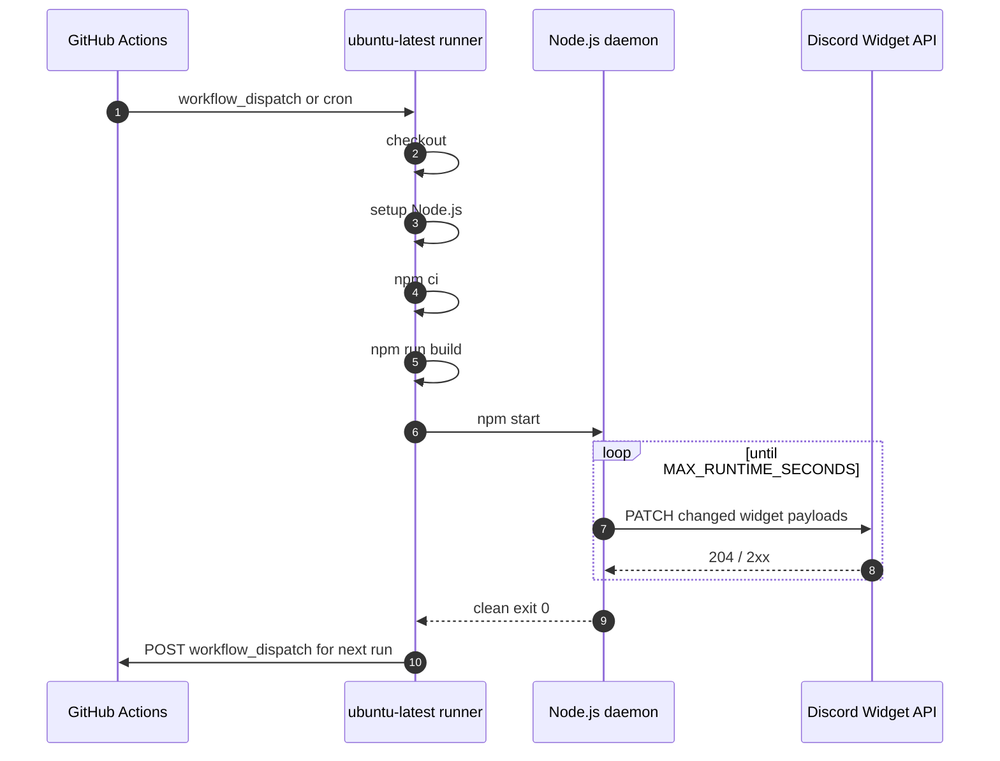

# Hosting

This project is designed to run as a GitHub Actions cloud daemon. No VPS, local PC, Docker container, database, or web server is required.

---

## GitHub Actions mode

Workflow file:

```text
.github/workflows/update.yml
```

Triggers:

```yaml
on:
  workflow_dispatch:
  schedule:
    - cron: "0 */6 * * *"
```

The schedule is a safety net. The main hosting pattern is self-dispatch: the daemon exits cleanly before the 6-hour runner limit, then the workflow queues the next run.

---

## Runtime lifecycle



---

## Runtime budget

GitHub-hosted runners have a hard job limit. The app has an inner soft limit:

```text
MAX_RUNTIME_SECONDS=21000
```

That is about 5h50m, leaving a buffer before the 6-hour hard stop.

If the job is manually cancelled, GitHub will show:

```text
The operation was canceled.
```

That is expected when you stop it from the Actions UI.

---

## Workflow environment

The workflow maps GitHub secrets into runtime environment variables:

```yaml
env:
  DISCORD_APP_ID: ${{ secrets.DISCORD_APP_ID }}
  DISCORD_USER_ID: ${{ secrets.DISCORD_USER_ID }}
  DISCORD_BOT_TOKEN: ${{ secrets.DISCORD_BOT_TOKEN }}
  LASTFM_API_KEY: ${{ secrets.LASTFM_API_KEY }}
  LASTFM_USERNAME: ${{ secrets.LASTFM_USERNAME }}
  DISCORD_IMAGE_WEBHOOK_URL: ${{ secrets.DISCORD_IMAGE_WEBHOOK_URL }}
  DISCORD_TARGET_CHANNEL_ID: ${{ secrets.DISCORD_TARGET_CHANNEL_ID }}
```

Optional settings are repository variables, not secrets.

---

## Local mode

For development:

```bash
npm install
cp .env.example .env
npm run build
npm start
```

For VPS/process-manager hosting:

```bash
npm run build
pm2 start dist/index.js --name vinyl-fm-widget
pm2 save
pm2 startup
```

In VPS mode, set:

```text
MAX_RUNTIME_SECONDS=0
```

`0` means run forever.

---

## Why not a normal cron every 5 minutes?

A short scheduled workflow can update stats, but it cannot feel live for music presence. A long-lived daemon gives:

- near-instant Discord `presenceUpdate` handling;
- fewer cold starts;
- in-memory image and Last.fm cache;
- less repeated command registration and setup work.

---

## Keeping one runner active

The workflow uses concurrency:

```yaml
concurrency:
  group: vinyl-fm-widget-daemon
  cancel-in-progress: false
```

This prevents two runs from fighting over the same Discord widget and rate-limit bucket.

---

## Logs to watch

Healthy startup:

```text
Vinyl.fm widget starting
Logging into Discord…
Discord bot is online
Guild slash commands registered
Starting poll loop
```

Healthy image pipeline:

```text
Prepared widget hero image through D.W.I.F pipeline
```

Healthy update:

```text
Patching Discord profile widget
Discord widget updated
```

No visible change:

```text
Widget unchanged; skipping Discord PATCH
```
