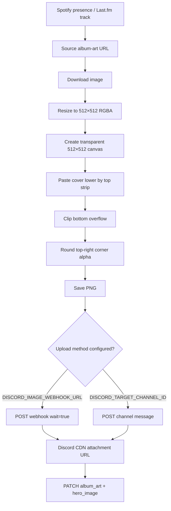

# Album-Art Image Pipeline

Discord profile widget image fields are picky: raw square album art can sit incorrectly inside the rounded widget frame. This project uses a D.W.I.F-style transform before sending album art to Discord.

The widget editor should bind its Image field to:

```text
album_art
```

The bot also sends `hero_image` for compatibility with older layouts.

---

## High-level flow



---

## Why correction is needed

Discord renders widget images inside a custom rounded/clipped container. If a plain square album cover is sent directly:

- the top area can collide with overlaid text;
- the top-right corner may not align with Discord's clipping shape;
- Discord may crop/scale the image differently from the widget preview.

The correction adds transparency and corner alpha so the final PNG already matches the widget frame.

---

## D.W.I.F-style transform

The transform is inspired by [D.W.I.F — Discord Widget Image Fixer](https://github.com/AjaxFNC-YT/D.W.I.F).

At the 512px reference size:

| Parameter | Value |
| --- | --- |
| Target size | `512×512` |
| Top strip base | `17px` |
| Corner radius base | `36px` |
| Output format | PNG with alpha |

The code path is intentionally manual and raw-buffer based because an earlier Sharp `composite().joinChannel()` implementation failed on some CDN images with:

```text
composite: images do not have same numbers of bands
```

The current implementation decodes to raw RGBA and edits alpha bytes directly, which is more predictable across image inputs.

---

## Upload methods

### Preferred: webhook upload

Set this repository secret:

```text
DISCORD_IMAGE_WEBHOOK_URL
```

Create a Discord channel webhook and paste the full webhook URL. This matches the image-hosting pattern used by [Discord-Lyrically-Widget](https://github.com/MeYashverma/Discord-Lyrically-Widget).

Request shape:

```http
POST {DISCORD_IMAGE_WEBHOOK_URL}?wait=true
Content-Type: multipart/form-data

file = lastfm-{hash}-dwif.png
```

### Fallback: bot channel upload

Set this repository secret:

```text
DISCORD_TARGET_CHANNEL_ID
```

The bot must have these permissions in that channel:

- View Channel
- Send Messages
- Attach Files
- Read Message History

Request shape:

```http
POST https://discord.com/api/v9/channels/{DISCORD_TARGET_CHANNEL_ID}/messages
Authorization: Bot {DISCORD_BOT_TOKEN}
Content-Type: multipart/form-data

files[0] = lastfm-{hash}-dwif.png
```

---

## Field output

When a corrected CDN URL is available, the widget payload includes both names:

```json
{
  "type": 3,
  "name": "album_art",
  "value": {
    "url": "https://cdn.discordapp.com/attachments/.../lastfm-abc-dwif.png"
  }
}
```

```json
{
  "type": 3,
  "name": "hero_image",
  "value": {
    "url": "https://cdn.discordapp.com/attachments/.../lastfm-abc-dwif.png"
  }
}
```

Use `album_art` in new widget designs.

---

## Caching

- Downloaded and processed files are written under `IMAGE_CACHE_DIR`.
- Default: `.cache/images`.
- The runner filesystem is temporary in GitHub Actions, so the cache only lasts for the current run.
- The important persistent output is the Discord CDN attachment URL.
- The daemon also keeps an in-memory map so the same album art URL is not processed/uploaded repeatedly during one run.

---

## Failure behavior

The image pipeline is non-fatal. Music text and stats should continue updating even if album-art correction fails.

| Failure | Fallback |
| --- | --- |
| Missing webhook/channel secret | Use direct album-art URL |
| Image download fails | Use direct album-art URL |
| Sharp decode fails | Use direct album-art URL |
| Webhook upload fails | Use direct album-art URL |
| Discord upload fails | Use direct album-art URL |

A healthy run should log:

```text
Prepared widget hero image through D.W.I.F pipeline
```

If you see this, the widget should be receiving a `cdn.discordapp.com` URL for `album_art`.

---

## Security note

Webhook URLs are credentials. Store `DISCORD_IMAGE_WEBHOOK_URL` only as a GitHub repository secret or local `.env` value. Do not commit it.
